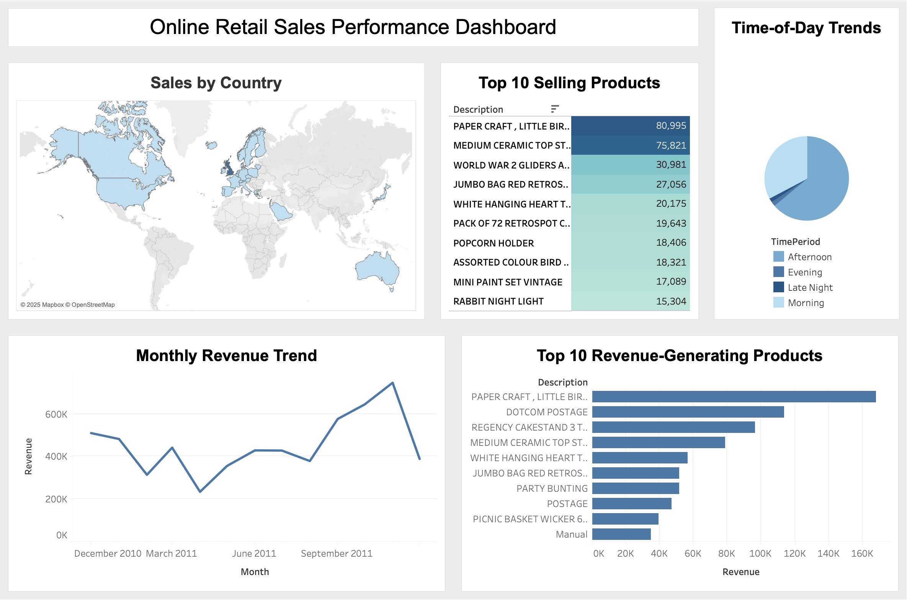

# 🧾 Online Retail Sales Analysis

This project analyzes a UK-based online retail store's transactions to uncover business insights such as top-selling products, monthly revenue trends, and purchasing patterns throughout the day. The full workflow was built using **MySQL** for data cleaning and transformation, and **Tableau** for interactive visualization.

---

## 📸 Dashboard Preview

---

## 📊 Dataset Overview

- **Source**: UCI Online Retail Dataset
- **Format**: CSV with 500,000+ rows
- **Fields**: InvoiceNo, StockCode, Description, Quantity, InvoiceDate, UnitPrice, CustomerID, Country

---

## 🛠️ Tools Used

- **SQL**: MySQL Workbench
- **Data Cleaning & Analysis**: SQL Queries
- **Data Visualization**: Tableau Desktop
- **Dashboard File**: `OnlineRetailDashboard.twb`

---

## 🧹 Data Cleaning & Transformation

Steps were performed on a duplicated table (`transactions_2`) to preserve the raw data. Key tasks:

- ✅ **Converted InvoiceDate** from string to proper `DATETIME`
- ✅ **Removed Duplicates** using `ROW_NUMBER()` and subqueries
- ✅ **Trimmed Text Fields** like Description, StockCode, and Country
- ✅ **Removed**:
  - Rows with missing key fields (e.g., InvoiceNo, Quantity)
  - Negative or zero quantities and prices
  - Cancelled transactions (InvoiceNo starting with "C")
- ✅ **Added Fields**:
  - `Revenue` = Quantity × UnitPrice
  - `InvoiceYear`, `InvoiceMonth`, `InvoiceDay`

---

## 📈 Analysis Performed in SQL

- Top 10 **selling products** (by quantity)
- Monthly **revenue trends**
- Top 10 **revenue-generating products**
- **Sales by country**
- **Time-of-day** purchasing behavior

---

## 📊 Tableau Dashboard

The cleaned dataset was visualized using Tableau. The dashboard includes:

- 📦 Top Selling Products
- 📆 Monthly Revenue Trends
- 🌎 Revenue by Country
- 🕒 Time-of-Day Trends

📂 Tableau File: [`OnlineRetailDashboard.twb`](./OnlineRetailDashboard.twb)

---

## 🔍 Key Insights

- Peak purchasing happens during **Afternoon hours**
- Revenue is dominated by **a few high-performing products**
- The **UK** drives the majority of sales
- Monthly trends reveal seasonal fluctuations in order volume

---

## ▶️ How to Run This Project

1. Load the SQL file: [`online_retail_project.sql`](./online_retail_project.sql)
2. Connect Tableau to your SQL database
3. Open the Tableau file: `OnlineRetailDashboard.twb`
4. Explore or extend the analysis

---

## 👤 Author

**Angel Macedo**  
*Data Analyst*

---
